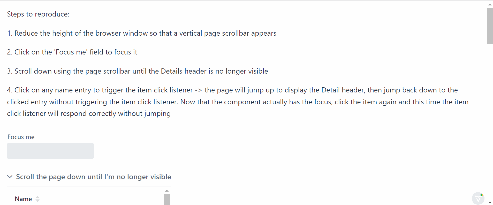

# Reproduction example of a "jumping" Grid problem

Steps to reproduce:
1. Reduce the height of the browser window so that a vertical page scrollbar appears
2. Click on the 'Focus me' field to focus it
3. Scroll down using the page scrollbar until the Details header is no longer visible
4. Click on any name entry to trigger the item click listener
   - the page will jump up to display the Detail header, then jump back down to the clicked entry without triggering the item click listener
   - now that the component actually has the focus, click the item again and this time the item click listener will respond correctly without jumping

